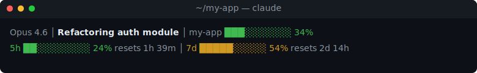

# claude-usage-statusline

A fast, zero-dependency statusline for [Claude Code](https://claude.ai/code) that shows your model, current task, directory, context window, **and** live 5-hour / 7-day API usage with reset countdowns.



- **5h / 7d bars** — fills as you consume each rate-limit window
- **Reset countdown** — two highest non-zero units, e.g. `resets 1h 39m`, `resets 2d 14h`, `resets 45m`
- **Device-clock driven** — countdown ticks smoothly between API refreshes; survives brief outages
- **Stale-cache marker** — a dim `∗` prefix appears if the API hasn't been reached in >10 min, so outages never read as "all good"
- **Context bar** — normalized against Claude Code's usable window (accounts for autocompact buffer)
- **Color thresholds** — green · yellow · orange · red at 50 / 75 / 90 %
- **Non-blocking** — statusline reads a 60s cache; usage is refetched by a detached background process, so rendering is instant
- **Zero dependencies** — pure Node, no `npm install`, no postinstall scripts

Inspired by [@vildanbina's `cc-usage-statusline` gist](https://gist.github.com/vildanbina/af6b1186fa529093bdd5d61bdf6d7b33). Rewritten in Node to fix macOS Keychain token storage, `stat -c` incompatibility, and to add GSD-style progress bars and reset countdowns.

---

## Install

```bash
git clone https://github.com/picoSols/claude-usage-statusline.git ~/.claude/claude-usage-statusline
~/.claude/claude-usage-statusline/install.sh
```

The install script:
1. Finds your `node` binary and resolves the **absolute path** (works with nvm, fnm, volta, brew, or system node)
2. Writes the `statusLine` entry into `~/.claude/settings.json` (creates or merges)
3. Primes the usage cache so bars appear immediately

Restart Claude Code. That's it.

<details>
<summary>Manual install (if you prefer)</summary>

Find your absolute node path:
```bash
which node        # e.g. /Users/you/.nvm/versions/node/v22.0.0/bin/node
```

Then edit `~/.claude/settings.json`:
```json
{
  "statusLine": {
    "type": "command",
    "command": "/absolute/path/to/node ~/.claude/claude-usage-statusline/statusline.js"
  }
}
```

> **Why the absolute path?** Claude Code runs statusline commands in a non-interactive shell that doesn't source `.bashrc`/`.zshrc`. Version managers like nvm, fnm, and volta rely on shell init scripts to put `node` on PATH, so a bare `node` command silently fails. The install script handles this automatically.

</details>

### Uninstall

```bash
rm -rf ~/.claude/claude-usage-statusline ~/.claude/cache/cc-usage.{json,lock}
```

…and remove the `statusLine` entry from `~/.claude/settings.json`.

---

## Requirements

- **Node.js 18+** (uses built-in `https` and `child_process` only)
- **Claude Code** authenticated via OAuth (i.e. `claude login`)
- **macOS, Linux, or WSL**

On macOS, the OAuth token lives in Keychain under `Claude Code-credentials`. On Linux, it lives at `~/.claude/.credentials.json`. The refresher tries Keychain first, then falls back to the file.

---

## How it works

Two tiny scripts:

| File | Role |
| --- | --- |
| `statusline.js` | Called by Claude Code on every render. Reads `~/.claude/cache/cc-usage.json` and prints the status line. If the cache is stale (>60s), spawns the refresher **detached** — render never waits on the network. |
| `cc-usage-refresh.js` | Fetches `GET https://api.anthropic.com/api/oauth/usage` (the same endpoint the Claude Code CLI uses), writes the result to cache. Lockfile prevents concurrent fetches. |

The cache file is a JSON snapshot:

```json
{
  "fetched_at": 1776132676,
  "five_hour":  { "utilization": 9,  "resets_at": "2026-04-14T04:00:00Z" },
  "seven_day":  { "utilization": 54, "resets_at": "2026-04-17T03:00:00Z" }
}
```

## Configuration

All via environment variables — no config file.

| Var | Default | Effect |
| --- | --- | --- |
| `CLAUDE_CONFIG_DIR` | `~/.claude` | Where to find `cache/` and credentials |
| `CC_CREDENTIALS` | `$CLAUDE_CONFIG_DIR/.credentials.json` | Fallback token file (non-macOS or when Keychain is empty) |

---

## Security

This tool is designed to be auditable in one sitting. The whole thing is ~200 lines of dependency-free JS.

**What it touches**

- Reads your Claude OAuth token from macOS Keychain (or `~/.claude/.credentials.json`)
- Sends exactly one request: `GET https://api.anthropic.com/api/oauth/usage` with `Authorization: Bearer <your token>` and `anthropic-beta: oauth-2025-04-20`
- Writes the response (utilization % + reset timestamps) to `~/.claude/cache/cc-usage.json`
- Reads your active-task info from `~/.claude/todos/` (same source as Claude Code itself)

**What it does NOT do**

- No telemetry, analytics, or phone-home
- No third-party network calls
- No writing to `.credentials.json` or modifying your token
- No `postinstall` or lifecycle scripts (there are no `npm` dependencies to install)
- No code loaded at runtime from outside this repo

**Before you install from any source**, diff `statusline.js` and `cc-usage-refresh.js` yourself — they're short enough to read in a couple of minutes.

**Reporting issues**: if you find a security problem, please open a GitHub issue or email the maintainer listed in `package.json` rather than posting a public PoC.

---

## Troubleshooting

**Nothing shows up at all (no statusline).**
Most likely `node` isn't found. Claude Code runs in a non-interactive shell that doesn't source `~/.bashrc`/`~/.zshrc`, so version managers (nvm, fnm, volta) aren't initialized. Fix: re-run the install script, or use an absolute path in your settings:
```bash
# Find your real node binary
which node    # nvm:   ~/.nvm/versions/node/v22.x.x/bin/node
              # fnm:   ~/.local/share/fnm/node-versions/v22.x.x/installation/bin/node
              # volta:  ~/.volta/bin/node
              # brew:  /opt/homebrew/bin/node
```
Then set the absolute path in `~/.claude/settings.json`:
```json
"command": "/absolute/path/to/node ~/.claude/claude-usage-statusline/statusline.js"
```

**The second line doesn't appear (first line works).**
Run the refresher manually once and check the cache:
```bash
node ~/.claude/claude-usage-statusline/cc-usage-refresh.js
cat ~/.claude/cache/cc-usage.json
```
If you see `"last_error": { "msg": "no-token" }`, your OAuth token couldn't be found. Re-run `claude login`.

**`HTTP 401` in `last_error`.**
Your OAuth token has expired or been rotated. Re-run `claude login`.

**Bars show but reset countdown is blank.**
Harmless — it means the API didn't return `resets_at` for that window. The response schema is not contractual; we surface what's there.

**I use a custom statusline already.**
Copy the `renderUsageLine()` function from `statusline.js` into your own — it takes no arguments and returns either `''` or a preformatted line starting with `\n`.

---

## Contributing

Small, focused PRs welcome. Keep zero-dep, keep under ~250 lines total. Please don't add a config file — env vars only.

## License

MIT — see `LICENSE`.

## Credits

- [@vildanbina](https://github.com/vildanbina) for the original [`cc-usage-statusline` gist](https://gist.github.com/vildanbina/af6b1186fa529093bdd5d61bdf6d7b33)
- The `gsd` (Get Shit Done) statusline for the bar-rendering style
